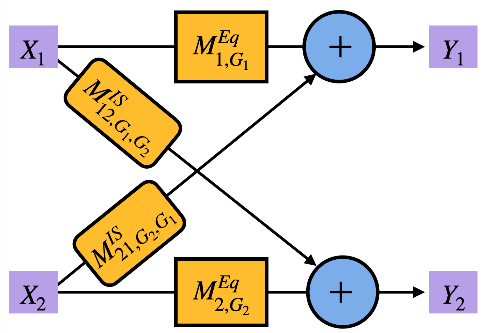
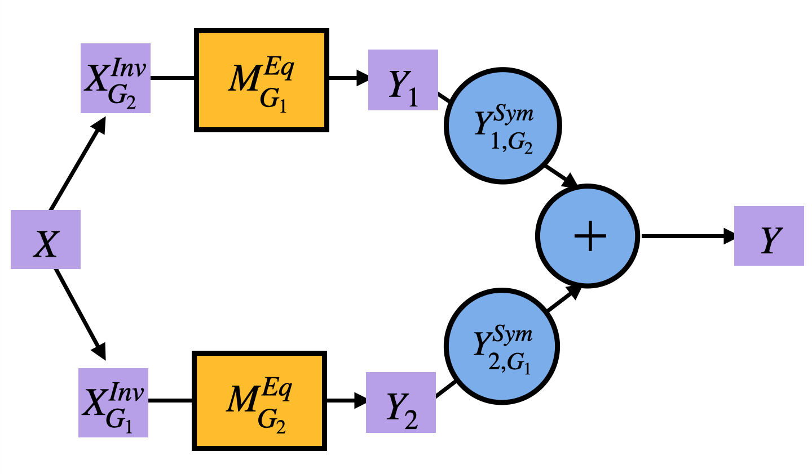

# Efficient Model-Agnostic Multi-Group Equivariant Networks

by Sourya Basu<sup>\*</sup>, Razan Baltaji<sup>\*</sup>, & Lav R. Varshney

Published in Transactions on Machine Learning Research (10/2024)

In this paper we introduce efficient, model-agnostic equivariant network designs to address the high computational cost associated with large product groups. We present two solutions: one for networks with multiple inputs acted on by different groups, and another for a single input affected by a large product group. The proposed methods improve computational efficiency while maintaining competitive performance across tasks such as multi-image classification, language compositionality, fairness in NLP, and zero-shot image classification.

<table>
  <tr>
    <td></td>
    <td></td>
  </tr>
  <tr>
    <td><p align="center">A Multi-Input Group Equivariant Network</p></td>
    <td><p align="center">A Model Equivariant to a Group Product</p></td>
  </tr>
</table>


## Abstract

Constructing model-agnostic group equivariant networks, such as equitune and its generalizations, can be computationally expensive for large product groups. We address this problem by providing efficient model-agnostic equivariant designs for two related problems: one where the network has multiple inputs each with potentially different groups acting on them, and another where there is a single input but the group acting on it is a large product group. For the first design, we initially consider a linear model and characterize the entire equivariant space that satisfies this constraint. This characterization gives rise to a novel fusion layer between different channels that satisfies an *invariance-symmetry* (*IS*) constraint, which we call an *IS layer*. We then extend this design beyond linear models, similar to equitune, consisting of equivariant and IS layers. We also show that the IS layer is a universal approximator of invariant-symmetric functions. 
Inspired by the first design, we use the notion of the IS property to design a second efficient model-agnostic equivariant design for large product groups acting on a single input. For the first design, we provide experiments on multi-image classification where each view is transformed independently with transformations such as rotations. We find  equivariant models are robust to such transformations and perform competitively otherwise. For the second design, we consider three applications: language compositionality on the SCAN dataset to product groups; fairness in natural language generation from GPT-2 to address intersectionality; and robust zero-shot image classification with CLIP. Overall, our methods are simple and general, competitive with equitune and its variants, while also being computationally more efficient.


## Multi-Image Classification
For installing all dependencies:
```bash
pip install -e .
```

### Downloading Datasets

To download `Caltech101`

```bash
cd Multi Image Classification/
mkdir data/
cd data/
wget https://data.caltech.edu/records/mzrjq-6wc02/files/caltech-101.zip
unzip caltech-101.zip
cd caltech-101/
tar -xvzf 101_ObjectCategories.tar.gz
```
To download `15Scene`
```bash
cd ../
wget https://s3-eu-west-1.amazonaws.com/pfigshare-u-files/12855452/15SceneImageDataset.rar
7z x 15SceneImageDataset.rar
```

### Training Models

```bash
bash get_resuls.sh
python compile_plots.py
```

### Compile Results

```bash
cd Multi Image Classification/
bash train.sh <DATASET>
```

### Notes:
- `<DATASET>`: Specify the dataset (`5Scene`, `Caltech101`).


## Compositional Generalization in Languages

### 1. Generate the _SCAN-II_ Dataset
To generate the SCAN-II dataset, run the following command:

```bash
cd EquiSCAN/SCAN/
python gen_scan_2.py
```

### 2. Pretrain Models
Pretrain models by specifying the layer type and the CUDA device:

```bash
cd ../sh/
bash pretrain.sh <LAYER_TYPE> <CUDA_DEVICE> train
```

Replace `<LAYER_TYPE>` with the type of layer you want to use and `<CUDA_DEVICE>` with the desired CUDA device ID.

### 3. Test Pretrained Models
To test the pretrained models, run:

```bash
bash pretrain.sh <LAYER_TYPE> <CUDA_DEVICE> test
```

### 4. Finetune Models
#### a. Finetune Equitune Models
To finetune models using Equitune, run:

```bash
bash finetune.sh <LAYER_TYPE> <CUDA_DEVICE> equi
```

#### b. Finetune Multi-Equitune Models
For Multi-Equitune models, use:

```bash
bash finetune.sh <LAYER_TYPE> <CUDA_DEVICE> multi_equi
```

### 5. Test Models
#### a. Test Equitune Models
To test Equitune models:

```bash
bash test.sh <LAYER_TYPE> <CUDA_DEVICE> equi
```

#### b. Test Multi-Equitune Models
For testing Multi-Equitune models:

```bash
bash test.sh <LAYER_TYPE> <CUDA_DEVICE> multi_equi
```

### Notes:
- `<LAYER_TYPE>`: Specify the layer type (e.g., `GRU`, `LSTM`, `RNN`).
- `<CUDA_DEVICE>`: Provide the CUDA device ID (e.g., `0` for the first GPU).

```bash
bash test.sh <LAYER_TYPE> <CUDA_DEVICE> multi_equi
```
